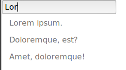
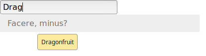

# DOM Filter class

Provides a simple interface for filtering a list of dom nodes.



Example usage:

Basic, search input at top:
```javascript
new DomFilter({
	insertBefore : 'nav ul',
	filterNodes : 'nav ul li'
});
```

Basic, search input at bottom:
```javascript
new DomFilter({
	insertAfter : 'nav ul',
	filterNodes : 'nav ul li'
});
```

Altering the text used on the filter

```javascript
new DomFilter({
	insertBefore : 'nav ul',
	filterNodes : 'nav ul li',
	strings: {
			'en': {
				'feedback': {
					'no_results'              : 'No matches',
					'default_feedback_message': ''
				},
				'input'   : {
					'placeholder': 'Search',
					'label'      : '&#1F50D;:'
				}
			}
		}
});
``` 

Custom match function (matching title as well as text content):



```javascript
new DomFilter({
	insertBefore : 'nav ul',
	filterNodes : 'nav ul li',
	/**
	 *
	 * @param node
	 * @param searchText
	 * @returns {boolean}
	 */
	matchFunction  : function ( node, searchText ) {
		var title = node.getAttribute('title'),
			nodeText = node.innerText.toLocaleLowerCase();
		searchText = searchText.toLocaleLowerCase();


		if ( typeof title !== 'string' ) {
			title = '';
		}

		title = title.toLocaleLowerCase();

		return (title.indexOf(searchText) > -1) || (nodeText.indexOf(searchText) > -1);
	}
});
```


Multiple filters on the same page, including tables
```javascript
new DomFilter({
	insertBefore : '.primary-nav ul',
	filterNodes : '.primary-nav ul li'
});

new DomFilter({
	insertBefore : '.secondary-nav ul',
	filterNodes : '.secondary-nav ul li'
});

new DomFilter({
	insertBefore : '.datatable',
	filterNodes : '.datatable tbody > tr'
});
```